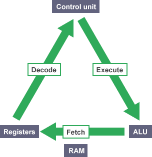

# Fundamentals of program
คอมพิวเตอร์ เป็นเครื่องจักที่โง่มาก แต่สามารถคำนวนตัวเลขได้อย่างรวดเร็ว ดังนั้นเราจึงจำเป็นต้องเป็นคนกำหนดว่า คอมพิวเตอร์จะต้องคำนวนอะไรบ้าง มีขั้นตอนการทำงานอย่างไร

## Instruction set
เป็นชุดคำสั่งสำหรับสั่งงาน cpu (ตัวประมวลผลของคอมพิวเตอร์)

**การเขียนโปรแกรม คือ** การเขียนชุดคำสั่งที่บอกว่า คอมพิวเตอร์จะต้องทำงานอย่างไร มีขึ้นตอนอะไรบ้างในการประมวลผล

## ส่วนประกอบของคอมพิวเตอร์
- **Central Processing Unit (CPU)** เป็นส่วนประมวลผลของคอมพิวเตอร์ ทุกชุดคำสั่งจะถูกส่งมาประมวลผลทีนี่
- **Random Access Memory (RAM)** จัดเก็บข้อมูลของโปรแกรม ในขณะที่โปรแกรมกำลังทำงาน
- **Hard drive (permanent storage)** จัดเก็บข้อมูลถาวร (แม้จะไม่จ่ายไฟ ข้อมูลก็ยังอยู่)
- **Operating System (OS)** ช่วยจัดการทุกอุปกรณ์ hardware สามารถทำงานร่วมกันได้

### Fetch / Execution Cycle (Life of a CPU)
- CPU จะทำการวนซ้ำดึงชุดคำสั่ง (instruction) จากหน่วยความจำ (register) และดำเนินการคำสั่ง
- **Giggahertz (GHz)** เป็นตัวบอกว่าใน 1 วินาที cpu ตัวนี้สามารวนซ้ำได้กี่ล้านครั้ง เช่น 2GHz แปลว่า สามารถวนซ้ำได้ 2 ล้านครั้งต่อวินาที

    

### Low level programmer language
เป็นภาษาที่คอมพิวเตอร์สามารถเข้าใจได้ เช่น assembly

### Higher level programming language
เป็นภาษาโปรแกรมที่ถูกออกแบบมาให้มนุษย์สามารถอ่านและเขียนได้ง่าย เช่น ภาษา C โดยเราไม่จำเป็นต้องจำคำสั่ง instruction สำหรับสั่งงาน CPU

### Compiler
ทำหน้าที่แปรงชุดคำสั่ง high level ไปเป็นชุดคำสั่ง low level (instruction) และคอยตรวจสอบว่า ชุคำสั่งที่เราเขียนใน high level ที่เราเขียน มีไวยากรณ์ที่ถูกต้องและเป็นไปตามกฏของภาษาหรือไม่

โดยปกติการเขียนโปรแกรม มักจะขั้นตอนดังนี้
1. กำหนดวัตถุประสงค์ของโปรแกรม
2. ออกแบบวิธีการทำงานของโปรแกรม
3. เขียนชุดคำสั่ง
4. คอมไพล์ชุดคำสั่ง
5. รันโปรแกรม
6. ทดสอบโปรแกรมเพื่อหาข้อผิดพลาด
7. บำรุงรักษาโปรแกรม